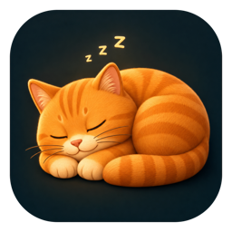
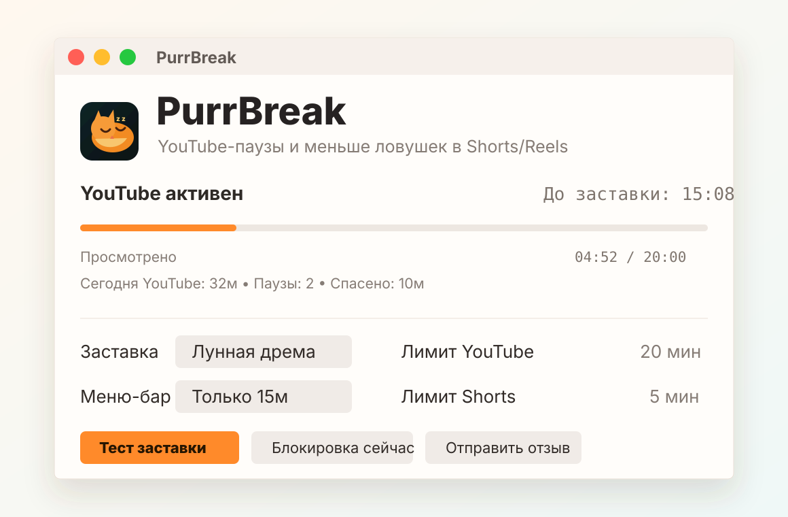
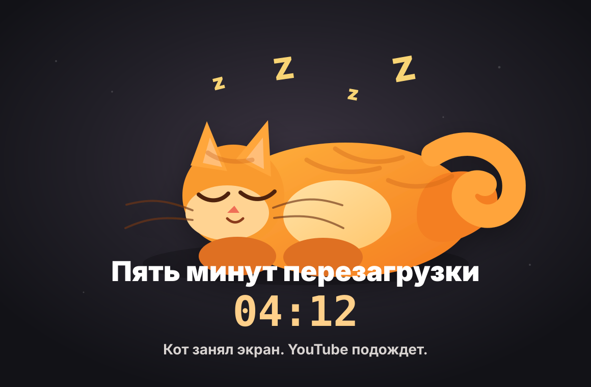

<p align="center">
  
</p>

<h1 align="center">PurrBreak</h1>

<p align="center">
  Мягкая open-source альтернатива жестким блокировщикам, сфокусированная на осознанных YouTube-паузах и снижении залипания в Shorts/Reels.<br>
  A gentle open-source alternative to strict blockers, focused on mindful YouTube breaks and fewer Shorts/Reels traps.
</p>

<p align="center">
  <a href="https://omiusgm.github.io/PurrBreak/">Домашняя страница / Homepage</a> ·
  <a href="#русский">Русский</a> ·
  <a href="#english">English</a> ·
  <a href="https://omiusgm.github.io/PurrBreak/companion/">PurrBreak Companion</a>
</p>

## English

PurrBreak is a gentle open-source macOS menu-bar app for mindful YouTube breaks. It tracks active YouTube time, gives Shorts a separate limit, and interrupts long sessions with a cozy animated cat break instead of a harsh block.

The optional PurrBreak Companion browser extension hides sticky YouTube hooks like Shorts, recommendations, comments, end walls, and autoplay. Instagram/Reels cleanup is available as an experimental extra.

- Project homepage: <https://omiusgm.github.io/PurrBreak/>
- Companion extension: <https://omiusgm.github.io/PurrBreak/companion/>
- Releases: <https://github.com/omiusgm/PurrBreak/releases>

## Русский

Маленькое macOS-приложение, которое считает время активного просмотра YouTube и запускает обязательную паузу с большим анимированным котом и мурчанием. Дополнительно в репозитории есть PurrBreak Companion - браузерное расширение, которое убирает Shorts, рекомендации и экспериментально помогает с Instagram Reels.

В отличие от строгих блокировщиков, PurrBreak не пытается наказать или запереть пользователя. Его задача проще: заметить момент залипания, мягко перекрыть экран на несколько минут и дать шанс вернуться в нормальное состояние.

<p align="center">
  
  
</p>

## Скачать приложение

1. Открой GitHub Releases.
2. Скачай `PurrBreak-*-macOS.zip`.
3. Распакуй архив.
4. Перетащи `PurrBreak.app` в `/Applications`.
5. На первом запуске нажми правой кнопкой по приложению и выбери `Open`.

Приложение пока подписано ad-hoc, без Apple Developer notarization. Поэтому macOS может предупредить, что приложение скачано из интернета. Это нормально для раннего open-source релиза.

## Разрешения macOS

PurrBreak читает URL активной вкладки браузера через macOS Automation, чтобы считать только YouTube, а не все время за компьютером.

При первом запуске PurrBreak покажет окно проверки браузера. Ничего заранее подключать не нужно: открой YouTube в браузере, которым пользуешься. Когда macOS попросит доступ Automation, его нужно разрешить.

Если запрос не появился или был отклонен:

1. Открой `System Settings`.
2. Перейди в `Privacy & Security` -> `Automation`.
3. Разреши `PurrBreak` управлять нужным браузером.

Окно `Проверка браузеров` показывает, получилось ли прочитать активную вкладку. Если галочка уже есть, делать ничего не нужно. Кнопка системных разрешений нужна только если запрос не появился, был отклонен или статус стал красным.

## Как это работает

- Приложение живет в меню-баре и раз в секунду проверяет активное приложение.
- Если активен поддерживаемый браузер, PurrBreak спрашивает у него URL активной вкладки через AppleScript/Automation.
- Если URL относится к `youtube.com` или `youtu.be`, счетчик просмотра увеличивается.
- Для `youtube.com/shorts` используется отдельный, более короткий лимит.
- Когда счетчик достигает лимита, показывается полноэкранная пауза с выбранной заставкой и мурчанием.
- После завершения паузы счетчик сбрасывается, а PurrBreak показывает маленькую развилку: вернуться к YouTube, взять еще 2 минуты или закрыть окно и вернуться к делам.
- PurrBreak не читает историю браузера, пароли, содержимое страниц и не отправляет данные наружу.

Текущий способ специально простой и локальный: приложение видит только активный браузер и URL активной вкладки. Более точный будущий вариант для браузеров вроде Firefox - отдельное расширение, которое сможет понимать не только адрес страницы, но и факт воспроизведения видео.

## Что уже есть

- Счетчик времени идет только когда на переднем плане Safari, Chrome, Yandex Browser, Brave, Edge, Arc, Chromium, Vivaldi или Opera с адресом `youtube.com` / `youtu.be`.
- В отдельном окне показывается проверка браузеров: подключен, нужен доступ Automation или пока не поддерживается.
- Firefox отображается в списке, но пока не поддерживается текущим AppleScript-механизмом чтения активной вкладки.
- По умолчанию после 20 минут YouTube начинается 3-минутная пауза.
- Для YouTube Shorts по умолчанию используется отдельный лимит 5 минут.
- На главном экране есть дневная статистика: время YouTube, количество пауз и сколько времени паузы вернули.
- Пауза ставит активное YouTube-видео на паузу и перекрывает все экраны поверх рабочих столов.
- После паузы появляется окно выбора следующего шага.
- В меню-баре показывается обратный отсчет до заставки. Формат можно выбрать: `Purr 12:43`, `12:43`, `13м` или варианты с иконкой.
- В настройках можно включить автозапуск при входе в macOS.
- Во время паузы играет синтезированное мягкое мурчание.
- Есть 4 заставки: `Рыжий сон`, `Лунная дрема`, `Дождливое окно`, `Космический сон`.
- Интерфейс можно переключить между русским и английским языком.
- В окне и меню-баре можно выбрать заставку, запустить тест без блокировки кликов, включить ручную блокировку и сбросить счетчик.
- На главном экране есть кнопка PurrBreak Companion: расширение убирает Shorts, рекомендации, комментарии, autoplay и экспериментально помогает с Instagram Reels.

## YouTube как музыка фоном

Если YouTube используется как фоновый музыкальный плеер во время работы, PurrBreak будет считать это временем YouTube. Текущая версия не умеет надежно отличать музыку от просмотра видео. Для такого сценария лучше заранее скачать плейлист или использовать отдельное музыкальное приложение.

## Дополнительно: убрать Shorts и рекомендации

PurrBreak Companion - экспериментальное браузерное расширение для Chrome, Yandex Browser, Arc, Brave, Edge, Opera, Vivaldi и Chromium. Оно не заменяет паузы PurrBreak, а убирает липкие элементы внутри сайтов. Сейчас главный фокус PurrBreak остается на YouTube, а Instagram/Reels - дополнительная опция.

Лендинг расширения: [`docs/companion`](https://omiusgm.github.io/PurrBreak/companion/).

YouTube MVP:

- Hide Shorts.
- Hide homepage.
- Hide sidebar / recommendations.
- Hide comments.
- Hide end wall.
- Disable autoplay.
- Focus mode.

Instagram MVP, пока экспериментально:

- Hide Reels.
- Hide Explore.
- Hide suggested accounts.

Локальная установка из исходников:

1. Открой `chrome://extensions`.
2. Включи developer mode.
3. Нажми `Load unpacked`.
4. Выбери папку [`extensions/purrbreak-companion`](extensions/purrbreak-companion).

Safari и iPhone потребуют отдельную Safari Web Extension-обертку позже.

## Сундук идей

Идеи, которые мы обсуждаем, но не обязательно сразу добавляем в приложение, лежат в [`docs/idea-chest.md`](docs/idea-chest.md).

## Проверка перед релизом

Ручной чеклист перед публикацией лежит в [`docs/manual-test-checklist.md`](docs/manual-test-checklist.md).

## Тест заставки

Кнопка `Тест заставки` показывает полноэкранный оверлей примерно на 20 секунд, но не перехватывает мышь. Это удобно, чтобы посмотреть анимацию и продолжать нажимать кнопки. Закрыть тест можно клавишей `Esc`, кнопкой `Остановить тест` или из меню-бара.

Кнопка `Блокировка сейчас` запускает настоящую паузу и перекрывает экран как обычное срабатывание лимита.

## Сборка из исходников

```zsh
./scripts/build-app.sh
open .build/PurrBreak.app
```

## Установка как обычной программы

```zsh
./scripts/install-app.sh
```

Скрипт попробует положить приложение сюда, чтобы оно появилось в Launchpad и Spotlight:

```text
/Applications/PurrBreak.app
```

Если у пользователя нет прав на `/Applications`, скрипт установит приложение сюда:

```text
~/Applications/PurrBreak.app
```

И создаст ярлык на рабочем столе:

```text
~/Desktop/PurrBreak.app
```

После этого приложение можно запускать из Finder, Spotlight или закрепить в Dock.

Если ярлык на рабочем столе не нужен:

```zsh
./scripts/install-app.sh --no-desktop
```

Если нужно принудительно установить только в пользовательскую папку:

```zsh
./scripts/install-app.sh --user
```

## Упаковка релиза

```zsh
./scripts/package-release.sh
```

Версия берется из файла [`VERSION`](VERSION). Архив появится в `dist/PurrBreak-<version>-macOS.zip`.

## Публикация на GitHub

1. Создай пустой публичный репозиторий `PurrBreak` на GitHub.
2. Скопируй SSH или HTTPS URL репозитория.
3. Запусти:

```zsh
./scripts/publish-github.sh git@github.com:USERNAME/PurrBreak.git
```

или:

```zsh
./scripts/publish-github.sh https://github.com/USERNAME/PurrBreak.git
```

Скрипт отправит `main` и тег из файла [`VERSION`](VERSION). После push тега GitHub Actions соберет `PurrBreak-<version>-macOS.zip`, `PurrBreak-Companion-<version>.zip` и создаст GitHub Release.

Домашняя страница проекта и лендинг Companion публикуются через GitHub Actions из папки [`docs`](docs).

Если GitHub Pages еще не включен:

1. Открой настройки репозитория на GitHub.
2. Перейди в `Pages`.
3. В `Build and deployment` выбери `GitHub Actions`.
4. Запусти workflow `Pages` или сделай push в `main`.

После публикации главная страница будет доступна по адресу `https://omiusgm.github.io/PurrBreak/`, а Companion - по адресу `https://omiusgm.github.io/PurrBreak/companion/`.

Для поля `About` на GitHub можно поставить:

- Website: `https://omiusgm.github.io/PurrBreak/`
- Description: `Gentle macOS YouTube breaks with an animated cat + Companion extension for Shorts/Reels`

## Разработка

```zsh
swift build
swift run PurrBreak
```
